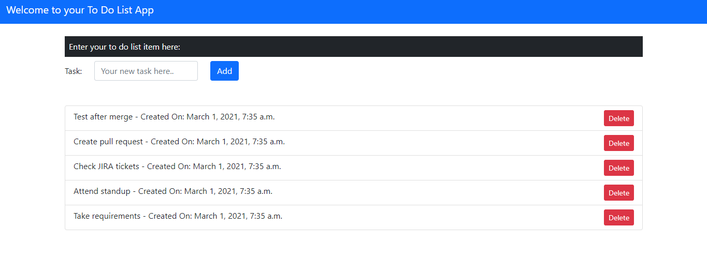
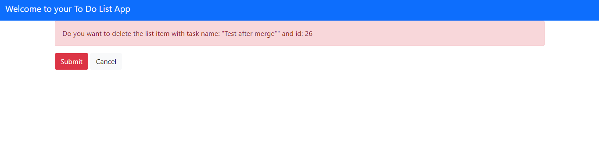

# This is To Do List App with User Authentication

## This app allows you and your authorized fellows to add task and delete task from to do list.
This project also contain testcases for forms and views created.

Please find UI of main app here in screenshots and video screencast.

### Video Screencast: 
https://www.loom.com/share/e1e37a9a6ea949ae95dc4f6d9ccf115e?sharedAppSource=personal_library

**Screen for adding to do list:**

**Screen for deleting item from to do list:**

### Video Screencast for user authentication:
https://www.loom.com/share/207124a07fd24e849a6c2eb5df23ce28

Further Enhancement: 
- Add restriction on deletion so that a user can only delete tasks created by him/her.

